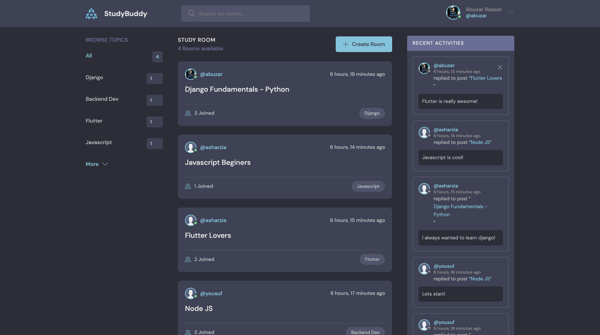
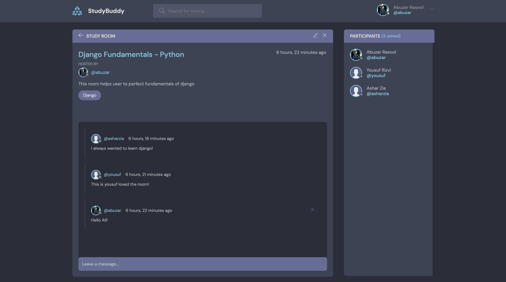
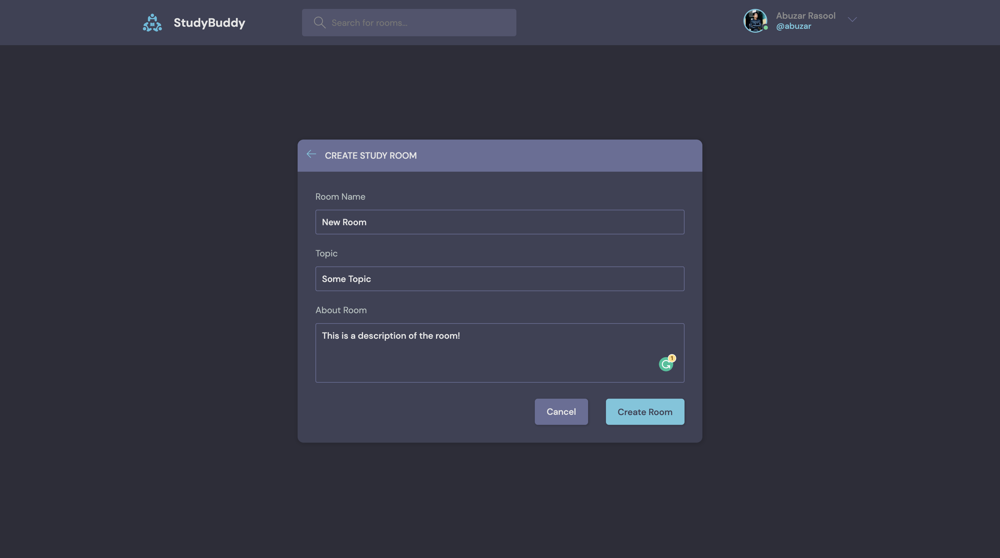
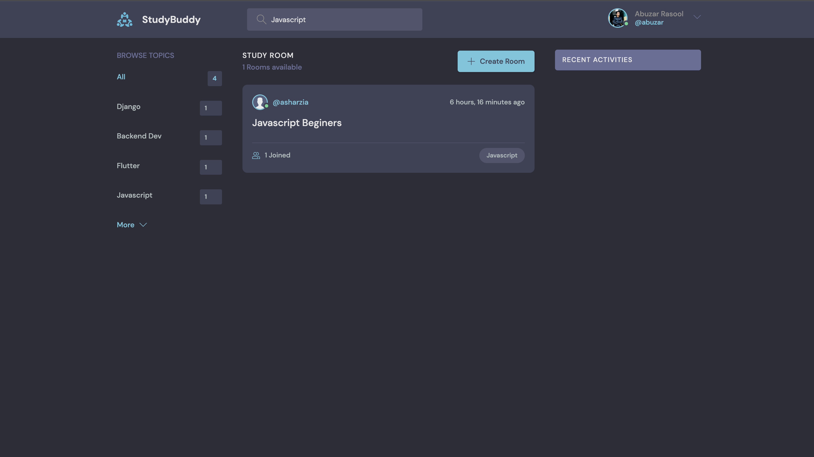
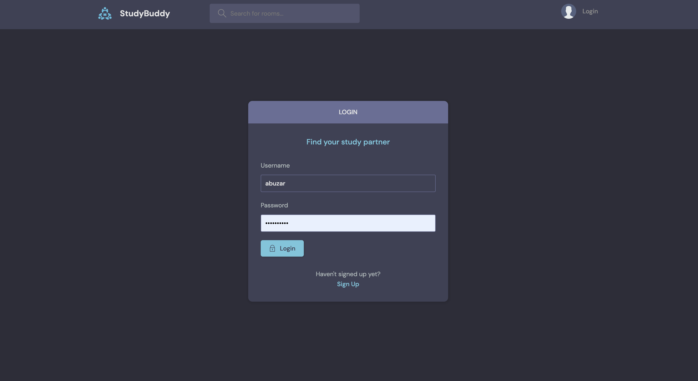
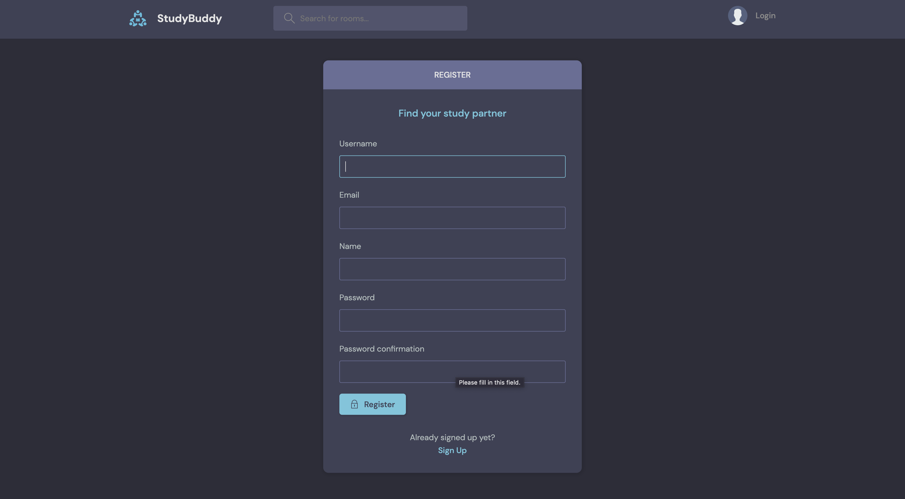
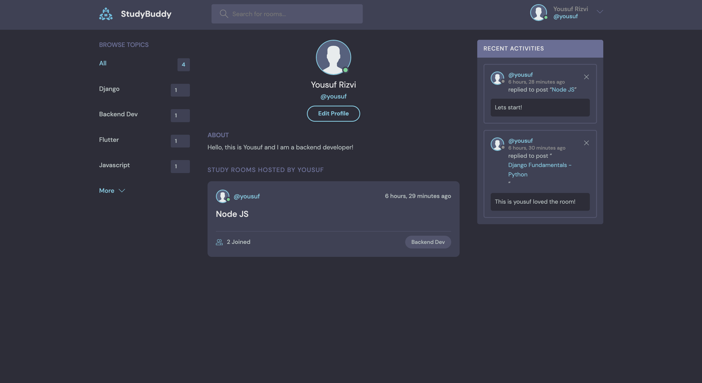
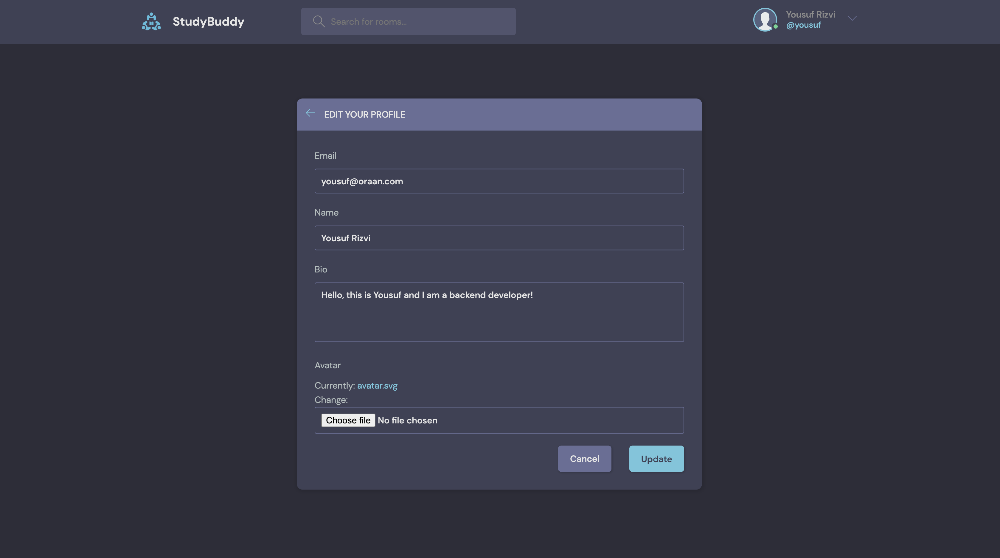

# StudyBuddy - Django
[](https://django-study-bud.herokuapp.com/)
[](https://django-study-bud.herokuapp.com/)


[](https://django-study-bud.herokuapp.com/)

This is my first django project which was created along with following the tutorial.

[Python Django 7 Hour Course - Traversy Media](https://www.youtube.com/watch?v=PtQiiknWUcI)  

The course was pretty comprehensive in terms of content and follwoing are my key learnings from this project.

- [x] Django REST Framework
- [x] Django Templates
- [x] Functional Views & URL's
- [x] Django Database Models
- [x] CRUD
- [x] Search
- [x] Implementing Custom User Model
- [x] Deploying django projects on [Heroku](https://heroku.com/)
- [x] Connecting external media buckets (AWS S3 and Cloudinary)
- [x] Integrating PostgreSQL 

### App Preview

<table width="100%"> 
<tr>
<td width="50%">      
&nbsp; 
<br>
<p align="center">
  Home
</p>

</td> 
<td width="50%">
<br>
<p align="center">
  Room Conversitions
</p>

</td>
 </tr>
  
  
 <tr>
<td width="50%">      
&nbsp; 
<br>
<p align="center">
  Create/Update Room
</p>

</td> 
<td width="50%">
<br>
<p align="center">
  Search
</p>

</td>
 </tr>
  
  <tr>
<td width="50%">      
&nbsp; 
<br>
<p align="center">
  Login
</p>

</td> 
<td width="50%">
<br>
<p align="center">
  Signup
</p>

</td>
 </tr>
  
  
  <tr>
<td width="50%">      
&nbsp; 
<br>
<p align="center">
  Profile
</p>

</td> 
<td width="50%">
<br>
<p align="center">
  Edit Profile
</p>

</td>
 </tr>
  
  
</table>


## API Reference

[](https://django-study-bud.herokuapp.com/api/)

#### Get all rooms

```http
  GET /api/rooms
```

#### Get single room

```http
  GET /api/rooms/${id}
```

| Parameter | Type     | Description                       |
| :-------- | :------- | :-------------------------------- |
| `id`      | `string` | **Required**. Id of room to fetch |


## Cloning the repository

--> Clone the repository using the command below :
```bash
git clone https://github.com/divanov11/StudyBud.git

```

--> Move into the directory where we have the project files : 
```bash
cd StudyBud

```

--> Create a virtual environment :
```bash
# Let's install virtualenv first
pip install virtualenv

# Then we create our virtual environment
virtualenv envname

```

--> Activate the virtual environment :
```bash
envname\scripts\activate

```

--> Install the requirements :
```bash
pip install -r requirements.txt

```

#

## Running the App

--> To run the App, we use :
```bash
python manage.py runserver

```

> ⚠ Then, the development server will be started at http://127.0.0.1:8000/

#

